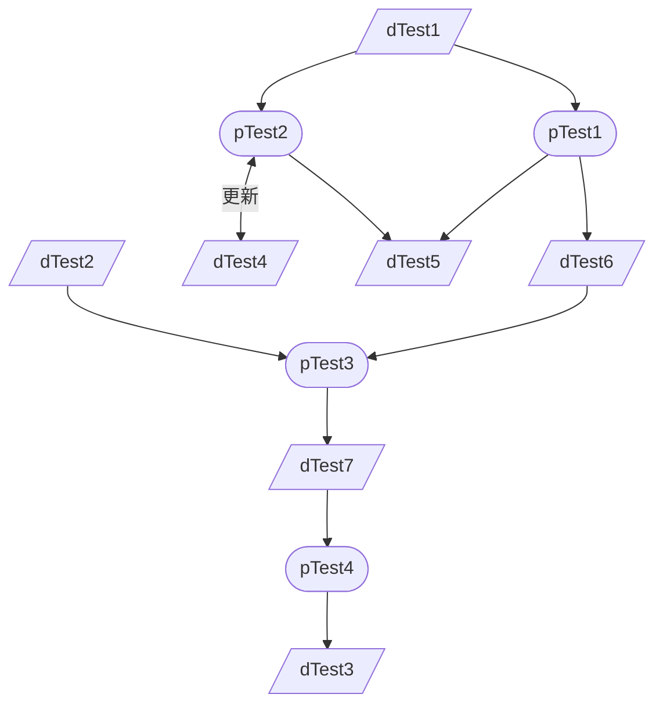

- [1. P01 test](#1-p01-test)
  - [1.1. 目的](#11-目的)
  - [1.2. 関係青果物](#12-関係青果物)
    - [1.2.1. 入力青果物](#121-入力青果物)
    - [1.2.2. 出力青果物](#122-出力青果物)
    - [1.2.3. 更新青果物](#123-更新青果物)
  - [1.3. PFD](#13-pfd)

# 1. P01 test

## 1.1. 目的

- ＊＊＊＊＊＊を目的とする

## 1.2. 関係青果物

### 1.2.1. 入力青果物

- D01_dTest1
- D02_dTest2

### 1.2.2. 出力青果物

- D03_dTest3

### 1.2.3. 更新青果物

- D04_dTest4

## 1.3. PFD

[このプロジェクトへのコントリビューションガイドライン](/D01_dTest1.md)

[このプロジェクトへのコントリビューションガイドライン](D01_dTest1.md)

<!-- Pre/code generated by SuperFences -->
<pre class="mermaid"><code>graph TB
    c1--&gt;a2
    subgraph one
    a1--&gt;a2
    end
    subgraph two
    b1--&gt;b2
    end
    subgraph three
    c1--&gt;c2
    end</code></pre>

<!-- Include Mermaid script and user config -->

const uml = className => {

  // Custom element to encapsulate Mermaid content.
  class MermaidDiv extends HTMLElement {

    /**
    * Creates a special Mermaid div shadow DOM.
    * Works around issues of shared IDs.
    * @return {void}
    */
    constructor() {
      super()

      // Create the Shadow DOM and attach style
      const shadow = this.attachShadow({mode: "open"})
      const style = document.createElement("style")
      style.textContent = `
      :host {
        display: block;
        line-height: initial;
        font-size: 16px;
      }
      div.diagram {
        margin: 0;
        overflow: visible;
      }`
      shadow.appendChild(style)
    }
  }

  if (typeof customElements.get("diagram-div") === "undefined") {
    customElements.define("diagram-div", MermaidDiv)
  }

  const getFromCode = parent => {
    // Handles <pre><code> text extraction.
    let text = ""
    for (let j = 0; j < parent.childNodes.length; j++) {
      const subEl = parent.childNodes[j]
      if (subEl.tagName.toLowerCase() === "code") {
        for (let k = 0; k < subEl.childNodes.length; k++) {
          const child = subEl.childNodes[k]
          const whitespace = /^\s*$/
          if (child.nodeName === "#text" && !(whitespace.test(child.nodeValue))) {
            text = child.nodeValue
            break
          }
        }
      }
    }
    return text
  }

  // Provide a default config in case one is not specified
  const defaultConfig = {
    startOnLoad: false,
    theme: "default",
    flowchart: {
      htmlLabels: false
    },
    er: {
      useMaxWidth: false
    },
    sequence: {
      useMaxWidth: false,
      noteFontWeight: "14px",
      actorFontSize: "14px",
      messageFontSize: "16px"
    }
  }
  
  // Load up the config
  mermaid.mermaidAPI.globalReset()
  const config = (typeof mermaidConfig === "undefined") ? defaultConfig : mermaidConfig
  mermaid.initialize(config)

  // Find all of our Mermaid sources and render them.
  const blocks = document.querySelectorAll(`pre.${className}, diagram-div`)
  const surrogate = document.querySelector("html body")
  for (let i = 0; i < blocks.length; i++) {
    const block = blocks[i]
    const parentEl = (block.tagName.toLowerCase() === "diagram-div") ?
      block.shadowRoot.querySelector(`pre.${className}`) :
      block

    // Create a temporary element with the typeset and size we desire.
    // Insert it at the end of our parent to render the SVG.
    const temp = document.createElement("div")
    temp.style.visibility = "hidden"
    temp.style.display = "display"
    temp.style.padding = "0"
    temp.style.margin = "0"
    temp.style.lineHeight = "initial"
    temp.style.fontSize = "16px"
    surrogate.appendChild(temp)

    try {
      mermaid.mermaidAPI.render(
        `_diagram_${i}`,
        getFromCode(parentEl),
        content => {
          const el = document.createElement("div")
          el.className = className
          el.innerHTML = content

          // Insert the render where we want it and remove the original text source.
          // Mermaid will clean up the temporary element.
          const shadow = document.createElement("diagram-div")
          shadow.shadowRoot.appendChild(el)
          block.parentNode.insertBefore(shadow, block)
          parentEl.style.display = "none"
          shadow.shadowRoot.appendChild(parentEl)
          if (parentEl !== block) {
            block.parentNode.removeChild(block)
          }
        },
        temp
      )
    } catch (err) {} // eslint-disable-line no-empty

    if (surrogate.contains(temp)) {
      surrogate.removeChild(temp)
    }
  }
}

// This should be run on document load
document.addEventListener("DOMContentLoaded", () => {uml("mermaid")})

