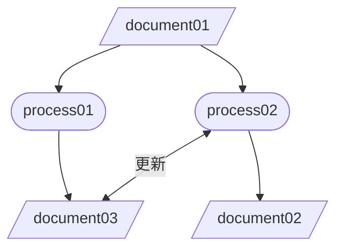

<!-- omit in toc -->
# link_fix

- [1. リポジトリルール](#1-リポジトリルール)
  - [1.1. 構成図](#11-構成図)
- [2. markdown rule](#2-markdown-rule)
  - [2.1. naming](#21-naming)
  - [2.2. template](#22-template)
  - [2.3. mermaid](#23-mermaid)

## 1. リポジトリルール

### 1.1. 構成図

```sample
├── .git
│   └── ...
├── .github(Github Actions yamlfile and python script)
│   └── workflows
│       ├── add_meraid_link
│       │   ├── main.py
│       │   ├── name.py
│       │   ├── re_pattern.py
│       │   └── search_target.py
│       └── main.yml
├── README.md
├── backup(backup using python script)
├── document
│   └── D001_***.md
│   └── ...
├── process
│   └── P001_***.md
│   └── ...
└── template
    └── D000_template.md
    └── P000_template.md
```

## 2. markdown rule

### 2.1. naming

|          | naming rule                          |
| -------- | ------------------------------------ |
| process  | P***_process-name.md(serial number)  |
| document | D***_document-name.md(serial number) |

```sample
P001_sample_process.md
D001_sample_document.md
```

### 2.2. template

|          | template                                      |
| -------- | --------------------------------------------- |
| process  | [p000_template.md](template/p000_template.md) |
| document | [d000_template.md](template/d000_template.md) |

### 2.3. mermaid

- flowchart TDで統一
- ノードはプロセス用、ドキュメント用の二種のみ
- ノードID（矢印を繋げる時に使用）と
  ノード名（実際のファイル名）はそれぞれつけること

|          | node id             | node type                           |
| -------- | ------------------- | ----------------------------------- |
| process  | pn**(serial number) | `([node name])` stadium-shaped node |
| document | dn**(serial number) | `[/node name/]`parallelogram        |

- プロセス用ノード、ドキュメント用ノード、矢印の順で記述する
  ※それぞれの間を一行開ける
- 矢印の間に文章を入れるときは右ノード前に記述する方法にする

```sample
mermaid
flowchart TD
    pn01([process01])
    pn02([process02])

    dn01[/document01/]
    dn02[/document02/]
    dn03[/document03/]

    dn01-->pn01
    dn01-->pn02
    pn01-->dn03
    pn02<-->|更新|dn03
    pn02-->dn02
```


